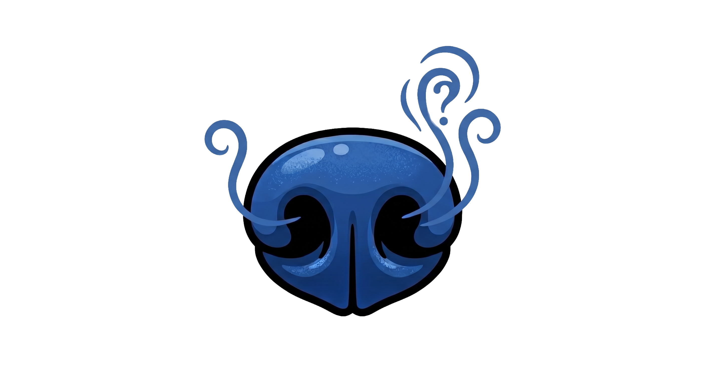
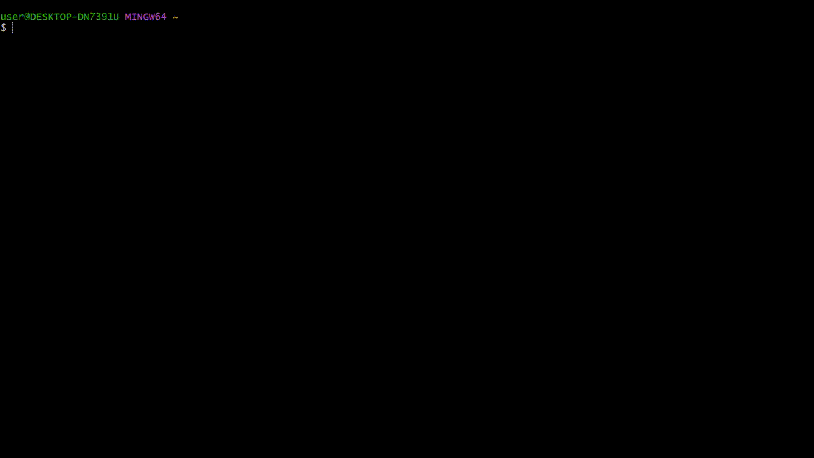

<p align="center">
  
</p>

> [!IMPORTANT]
> **This project is currently under active development.** Features are subject to change, and we are working hard to reach a stable 1.0 release.

<p align="center"><strong>Docklog</strong> is an optimized, multiplexed, real-time log aggregator and tracking CLI for Docker.</p>

Running multiple Docker containers and keep missing errors because they scroll away in different terminals? Docklog aggregates all your container logs into a single, color-coded stream so you never lose an error again.

<p align="center">
  
</p>

---

## Table of Contents

- [Why Docklog?](#why-docklog)
- [Architecture](#architecture)
- [Installation](#installation)
- [Getting Started](#getting-started)
- [Advanced Usage](#advanced-usage)
  - [Container Targeting](#container-targeting)
  - [Regex & Exclusion Filtering](#regex--exclusion-filtering)
  - [JSON & File Output](#json--file-output)
  - [Masking / Censoring (Redact)](#masking--censoring-redact)
  - [Smell Error](#smell-error)
- [Configuration](#configuration)
- [Contributing](#contributing)

---

## Why Docklog?

`docker logs -f` works fine for a single container. But when you have a Postgres, Redis, and a backend service all running at the same time, you are opening multiple terminals, switching between tabs, and errors are scrolling away before you can read them.

Docklog fixes this with a surgical CLI approach:

1. **Multiplexed Streaming:** Watch all your containers in a single terminal window, color-coded by container name.
2. **Zero-Overhead Filtering:** Drop noisy logs (e.g., health checks) before they ever reach your terminal.
3. **Smart Deduplication:** Prevent aggressive error loops from burying the root cause with consecutive message suppression.
4. **Structured Output:** Stream directly to JSON files for ingestion by Splunk, ELK, or Datadog agents.

---

## Architecture

Docklog interfaces directly with the local Docker Engine API via the Unix socket (`/var/run/docker.sock` or Windows Pipe).

It dynamically discovers running containers and listens for Docker Engine `start` and `die` events to attach or detach streams automatically — meaning you can start Docklog once, and it will automatically pick up containers that are started later.

The internal **Pipeline** utilizes concurrent `io.Pipe` streams, processing Stdout and Stderr asynchronously through a centralized formatting and filtering engine, ensuring zero race conditions and thread-safe outputs.

---

## Installation

### Using Go Install (Recommended)

```bash
go install github.com/doguhanniltextra/docklog@latest
```

Ensure your `$GOPATH/bin` is in your system's `$PATH`. You can verify the installation by running:

```bash
docklog --version
```

### From Source

Ensure you have [Go 1.21+](https://go.dev/) installed.

```bash
git clone https://github.com/doguhanniltextra/docklog.git
cd docklog
go build -o docklog
./docklog --version
```

---

## Getting Started

Start streaming logs from all currently running containers:

```bash
docklog start
```

Press `Ctrl+C` to gracefully terminate the streams and exit.

---

## Advanced Usage

Docklog provides POSIX-compliant flags for granular control over your log streams.

### Container Targeting

Listen only to containers whose names match a specific regular expression. This prevents Docklog from attaching to unrelated containers, saving CPU and memory.

```bash
# Listen only to containers starting with "api-" or "db-"
docklog start --container "^(api|db)-.*"
```

### Regex & Exclusion Filtering

Find exactly what you are looking for, and ignore the noise.

```bash
# Only show logs containing the word "timeout"
docklog start --filter "timeout"

# Show all logs, EXCEPT those containing "healthcheck"
docklog start --exclude "healthcheck"

# Advanced Regex: Find panic traces or specific ID formats
docklog start --regex "panic: runtime error|req_id=[A-Z0-9]+"
```

### JSON & File Output

Export your aggregated logs to a file, either in raw text or structured JSON.

```bash
# Output colored logs to terminal, and raw logs to logs.txt
docklog start --output logs.txt

# Output structured JSON (disables terminal colors)
docklog start --json --output logs.json
```

### Masking / Censoring (Redact)

Automatically mask sensitive data (Emails, IPv4, Bearer Tokens, API Keys) in your logs. When enabled, matching patterns are replaced with `***` before being printed or written to a file.

```bash
docklog start --redact
```

> **If you're working with AI, it's recommended to protect your credentials before pasting logs into it.**

### Smell Error

This is Docklog's most powerful command, built specifically for debugging critical failures.

The problem: when a container starts crashing, it often spams the same error thousands of times per second. The root cause gets buried under the noise, and you end up scrolling endlessly trying to find where it actually started.

`docklog smell-error` solves this by automatically filtering for errors and enabling deduplication — so each unique error is shown exactly once, no matter how many times it repeats.

```bash
# Watch all containers for errors, deduplicated
docklog smell-error

# Target a specific broken container
docklog smell-error --container "broken-postgres"
```

**Example scenario:** Your Postgres container fails to start because of a missing password. Instead of seeing the same authentication error 10,000 times, you see it once — clearly, immediately.

```
ERROR [07:22:12.902] container="broken-postgres" Database is uninitialized and superuser password is not specified.
ERROR [07:22:12.902] container="broken-postgres" You must specify POSTGRES_PASSWORD on docker run.
```

Root cause found. No scrolling required.

---

## Configuration

Docklog is built with Viper, meaning it supports configuration files to save your favorite parameters.

Create a `.docklog.yaml` file in your home directory (`~/.docklog.yaml`) or in your current working directory:

```yaml
# ~/.docklog.yaml
container: "^(core|auth)-.*"
exclude: "DEBUG"
tail: "50"
json: false
```

Flags passed via the CLI will always override the values in the configuration file.

---

## Contributing

Contributions are welcome.

1. Fork the repository
2. Create your feature branch (`git checkout -b feature/amazing-feature`)
3. Ensure tests pass (`go test -v ./...`)
4. Commit your changes (`git commit -m 'feat: add amazing feature'`)
5. Push to the branch (`git push origin feature/amazing-feature`)
6. Open a Pull Request

---

## License

This project is licensed under the MIT License see the [LICENSE](LICENSE) file for details.