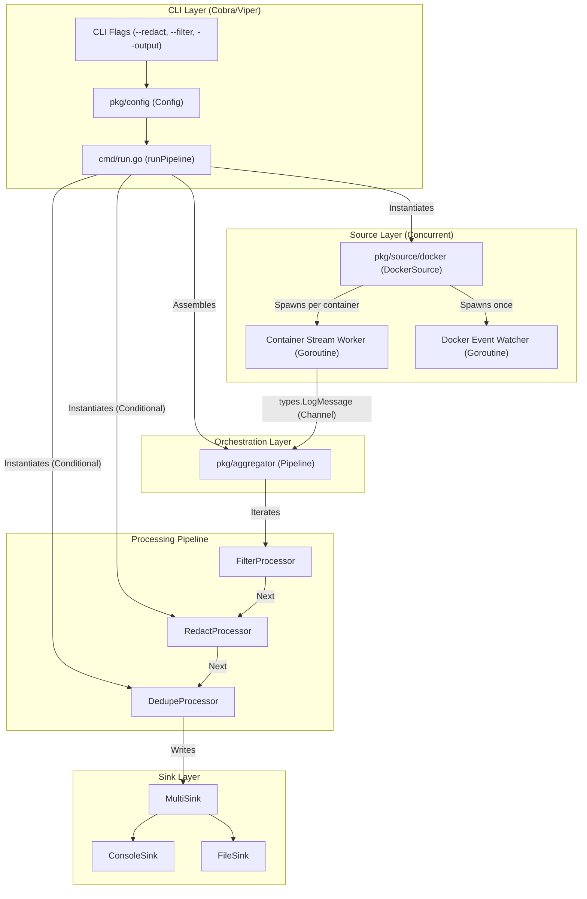

# Docklog Architecture Flow

This document provides a visual and technical breakdown of the Docklog modular architecture.

## 1. System Overview

The following diagram illustrates how CLI flags trigger component instantiation and how log data flows through concurrent workers into the central pipeline.

## 2. Concurrency Model

Docklog leverages Go's concurrency primitives to handle thousands of log lines from multiple containers without blocking.

| Component | Concurrency Mechanism | Purpose |
| :--- | :--- | :--- |
| **Source Watcher** | `go source.Run()` | The main pipeline starts the source in the background so it can begin processing messages immediately. |
| **Event Watcher** | `go cli.Events()` | Monitors the Docker daemon for `start` and `die` events to dynamically add/remove containers from the pipeline. |
| **Container Streams** | `go startContainerStream()` | Every container gets its own goroutine to prevent a slow container from blocking others. |
| **Demuxer** | `go readStream()` | Within each container stream, **two goroutines** handle `stdout` and `stderr` separately using `io.Pipe`. |
| **Log Channel** | `chan types.LogMessage` | A buffered channel (size controlled by `--buffer`) acts as the "Glue" between the asynchronous producers and the synchronous processing pipeline. |

## 3. The Pipeline Flow

The `aggregator.Pipeline` follows a strict **Source -> Processor[] -> Sink** pattern:

1.  **Ingestion:** The `Source` (Docker) pushes a `types.LogMessage` into the pipeline's channel.
2.  **Transformation:** The pipeline iterates through the `processors` slice. Each processor can:
    *   **Modify:** Change the message (e.g., `RedactProcessor` masks sensitive data).
    *   **Drop:** Return `keep=false` to stop further processing (e.g., `FilterProcessor` removes unwanted lines).
    *   **Pass:** Return the message as-is.
3.  **Delivery:** If the message survives all processors, it is handed to the `Sink`. If `--output` is specified, a `MultiSink` duplicates the message to both the `Console` and a `File`.

## 4. Flag Integration

CLI flags directly control the "Ingredients" of the pipeline:

*   **`--redact`**: If true, `RedactProcessor` is appended to the pipeline.
*   **`--filter` / `--exclude`**: Configures the `FilterProcessor` logic.
*   **`--output`**: Triggers the creation of a `FileSink` and wraps everything in a `MultiSink`.
*   **`--container`**: Handled early in the `DockerSource` to avoid even opening a stream for non-matching containers.
*   **`--json`**: Determines which `formatter.Formatter` is injected into the Sinks.
